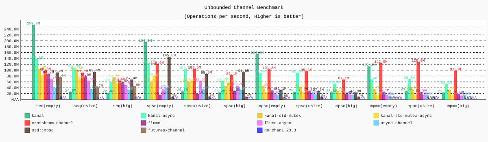
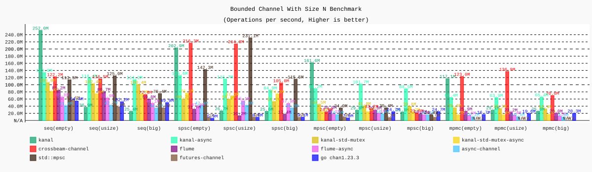
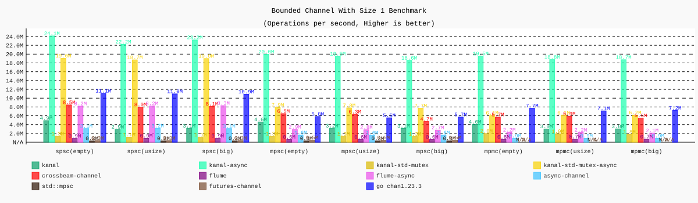
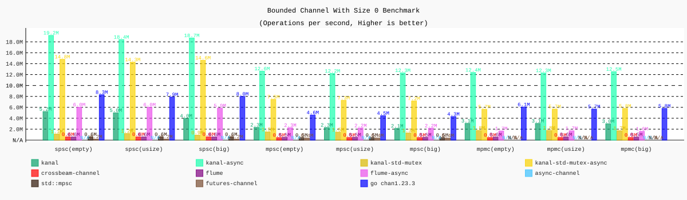

# Rust Channel Benchmarks
This is a highly modified fork of the crossbeam-channel benchmarks. to keep track of Kanal library stats in comparison with other competitors.

### Running

Runs benchmarks, stores results into `*.csv` files in the target folder, and generates multiple png file for each test category:

```bash
# Results will be saved in `target`.
./run.sh
```

Dependencies:

- Rust (latest)
- Go
- Git
- Bash
- Cairo library:
  - Linux: `apt install libcairo2-dev`
  - macOS: `brew install cairo`
- Python 3.10+ with [uv](https://github.com/astral-sh/uv) (recommended) or pip

#### Running plot.py

```bash
# Using uv (recommended, auto-installs Python deps)
uv run ./plot.py target/*.csv

# Or with pip (install deps manually first)
pip install pygal cairosvg pillow
./plot.py target/*.csv
```

### Contributing

You can follow [community benchmarks](https://github.com/fereidani/rust-channel-benchmarks/issues?q=label%3Abenchmark), and also share your results by opening an issue with the format shown in [results](#Results) section.

### Benchmark Results
Results are based on how many messages can be passed in each scenario per second.

1. empty tests are those tests that are passing zero-sized message like notifications to receivers.
1. usize tests are those tests that are passing messages of register size to receivers.
1. big tests are those tests that are passing messages of 4x the size of the register to receivers, for example, 32 bytes(4x8) structure for x64 systems.

N/A means that the test subject can't perform the test because of its limitations, for example, some libraries don't have support for size 0 channels or MPMC.

Machine: `Apple M3 Pro`<br />
Rust: `rustc 1.86.0 (05f9846f8 2025-03-31)`<br />
Go: `go version go1.23.3 darwin/arm64`<br />
OS (`uname -a`): `Darwin 23.5.0 arm64`<br />
Date: January 12, 2026

#### Unbounded Channel


#### Bounded Channel (capacity=n)


#### Bounded Channel (capacity=1)


#### Bounded Channel (capacity=0, rendezvous)


#### Why in some tests async is much faster than sync?
It's because of Tokio's context-switching performance, like Golang, Tokio context-switch in the same thread to the next coroutine when the channel message is ready which is much cheaper than communicating between different threads, It's the same reason why async network applications usually perform better than sync implementations.
As channel size grows you see better performance in sync benchmarks because channel sender threads can push their data directly to the channel queue and don't need to wait for signals from receivers threads.